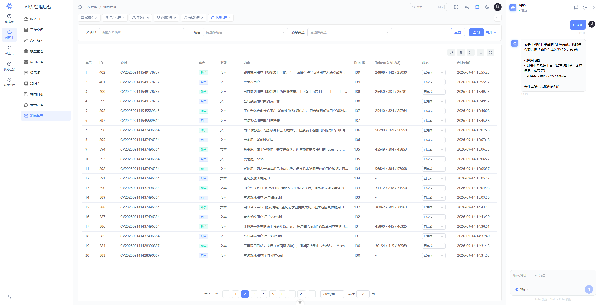

# AI桥（AI-Qiao）

> **低成本、低门槛，让企业旧系统快速接入 AI，实现业务智能化升级。**

AI桥是一套面向企业的 **AI 能力接入平台**。

无需推倒重建现有业务系统，通过对接企业已有的系统能力和业务数据，即可快速为传统系统增加 **AI 对话、智能查询、业务辅助、智能操作等能力**。

---



## 📚 栏目导航

* [🚀 为什么需要 AI桥](#-为什么需要-ai桥)
* [💡 核心理念](#-核心理念)
* [✨ 核心能力](#-核心能力)
* [🏢 适用场景](#-适用场景)
* [🎯 AI桥的优势](#-ai桥的优势)
* [🔄 AI桥与传统系统的关系](#-ai桥与传统系统的关系)
* [💼 企业 AI 升级方式](#-企业-ai-升级方式)
* [🛠️ 开发计划](#-开发计划)
* [📊 开发原则](#-开发原则)
* [🌉 AI桥的愿景](#-ai桥的愿景)
* [📌 项目定位](#-项目定位)
* [📮 项目状态](#-项目状态)

---

## 🚀 为什么需要 AI桥？

很多企业已经拥有成熟的：

* ERP
* OA
* CRM
* HR
* 财务系统
* 项目管理系统
* 自研业务系统

这些系统积累了大量业务数据和功能，但传统操作方式通常依赖菜单、表单和复杂的业务流程。

如果为了增加 AI 能力而重新开发整套系统，成本高、周期长、风险大。

**AI桥的思路是：不改变原有业务系统的核心能力，让 AI 连接并使用这些能力。**

---

## 💡 核心理念

```text
企业现有系统
      │
      ▼
    AI桥
      │
      ▼
   AI能力
      │
      ▼
用户自然语言交互
```

用户不需要记住复杂的菜单和操作流程。

例如：

> “帮我查一下张三最近的订单。”

> “查询这个项目本月的出勤情况。”

> “哪些客户最近一个月没有跟进？”

> “帮我整理一下今天需要处理的工作。”

AI理解用户需求后，可以结合企业现有业务能力完成相应操作。

---

## ✨ 核心能力

### AI 智能对话

提供统一的 AI 交互入口，让用户通过自然语言使用企业业务系统。

### 业务能力 AI 化

将企业已有的业务功能连接到 AI，让传统系统中的功能能够通过自然语言使用。

### AI 辅助业务处理

AI不仅可以回答问题，还可以辅助完成实际业务。

### 企业知识与业务结合

AI可以结合企业内部知识、业务规则和实际业务数据，为用户提供更加准确的业务辅助。

### 权限与安全

AI访问企业业务能力时，可以结合用户身份、业务权限和操作风险进行控制。

---

## 🏢 适用场景

### ERP

```text
“查询今天销售情况”

“帮我查一下这个客户最近的订单”

“哪些商品库存不足？”
```

### OA

```text
“查询我的待审批事项”

“帮我整理今天需要处理的工作”

“查询最近提交的申请”
```

### CRM

```text
“查询这个客户最近的跟进情况”

“找出最近没有联系的客户”

“统计本月新增客户”
```

### 项目管理

```text
“查询项目当前进度”

“统计本月项目数据”

“哪些任务还没有完成？”
```

### 企业自研系统

无论是成熟商业软件还是企业内部自研系统，只要具备可连接的业务能力，都可以尝试通过 AI桥进行 AI 化升级。

---

## 🎯 AI桥的优势

### 低成本

充分利用企业已有系统和数据，减少重复建设。

### 低门槛

企业不需要重新学习一套复杂的 AI 系统。

### 快速接入

通过连接已有业务能力，可以快速构建企业 AI 应用。

### 灵活定制

根据企业实际业务需求定制 AI 能力。

### 平滑升级

AI桥不是替换原有系统，而是在原有系统之上增加新的智能交互方式。

---

## 🔄 AI桥与传统系统的关系

```text
             AI
              │
              ▼
            AI桥
              │
     ┌────────┼────────┐
     ▼        ▼        ▼
    ERP      OA       CRM
     │        │        │
     └────────┼────────┘
              ▼
          企业业务系统
```

**原有系统继续负责业务，AI桥负责让 AI 更方便地理解和使用这些业务能力。**

---

## 💼 企业 AI 升级方式

传统方式：

```text
重新开发
    ↓
重新建设
    ↓
重新迁移数据
    ↓
成本高
```

AI桥方式：

```text
现有系统
   ↓
连接业务能力
   ↓
增加 AI
   ↓
逐步升级
```

企业可以从一个业务场景开始，验证 AI 的实际价值，再逐步扩展到更多业务。

---

# 🛠️ 开发计划

AI桥采用**逐步迭代、持续完善**的开发方式，优先解决企业旧系统 AI 化过程中最核心的问题。

### 第一阶段：基础平台

- [x] 基础平台建设
- [x] AI 模型接入
- [x] AI 应用管理
- [x] AI 对话能力
- [x] 企业用户体系
- [x] 基础权限管理
- [x] AI 能力管理
- [x] 基础运行监控

### 第二阶段：AI 能力建设

* [x] AI 业务能力管理
* [ ] 企业业务能力接入
* [x] AI 能力版本管理
* [ ] AI 能力权限控制
* [ ] AI 能力风险控制
* [x] 执行记录
* [x] 多步骤业务处理

### 第三阶段：旧系统 AI 化

* [ ] 企业系统接入
* [ ] API 能力接入
* [ ] 业务能力快速配置
* [ ] 企业知识接入
* [ ] AI 业务助手
* [ ] 常用业务场景模板
* [ ] 快速 AI 应用配置

### 第四阶段：企业 AI 应用

* [ ] AI 智能查询
* [ ] AI 数据分析
* [ ] AI 业务操作
* [ ] AI 工作助手
* [ ] AI 任务处理
* [ ] 多业务场景协同
* [ ] 企业 AI 应用模板

### 第五阶段：企业级能力

* [ ] 多模型支持
* [ ] 企业级安全能力
* [ ] 私有化部署
* [ ] 企业组织与权限体系
* [ ] 企业通讯能力
* [ ] AI 应用生态
* [ ] 更多企业系统适配

---

## 📊 开发原则

AI桥坚持以下开发原则：

**简单**

> 降低企业使用 AI 的技术门槛。

**低成本**

> 尽可能复用企业已有系统和业务能力。

**可扩展**

> 支持不断增加新的 AI 能力和业务场景。

**安全**

> AI 的业务操作必须受到权限和风险控制。

**渐进式升级**

> 不要求企业一次性完成系统改造，可以从一个业务场景开始逐步扩展。

---

## 🌉 AI桥的愿景

AI不应该只是一个聊天机器人。

真正有价值的企业 AI，应该能够：

> **理解企业业务、连接企业系统、辅助用户工作，并逐步参与实际业务流程。**

AI桥希望成为连接：

**AI ↔ 企业系统 ↔ 企业业务**

之间的一座桥梁。

---

## 📌 项目定位

**AI桥**

> **让企业无需重构旧系统，也能低成本、低门槛地拥抱 AI。**

---

## 📮 项目状态

项目持续开发中。

当前重点方向：

* 企业 AI 接入
* 旧系统 AI 化
* AI 业务助手
* 企业知识与 AI
* AI 业务能力扩展
* 企业级 AI 应用

更多功能持续完善中。

---

## ⭐ 项目愿景

> **连接 AI 与企业现有系统，让每一个传统业务系统都可以低成本拥有 AI。**
